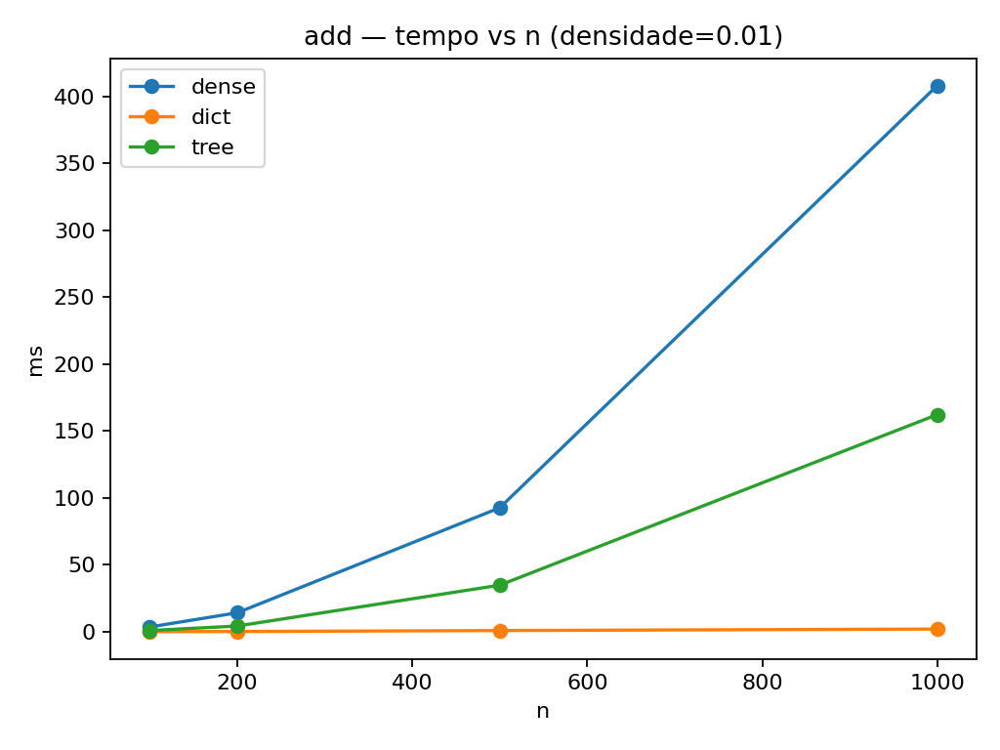
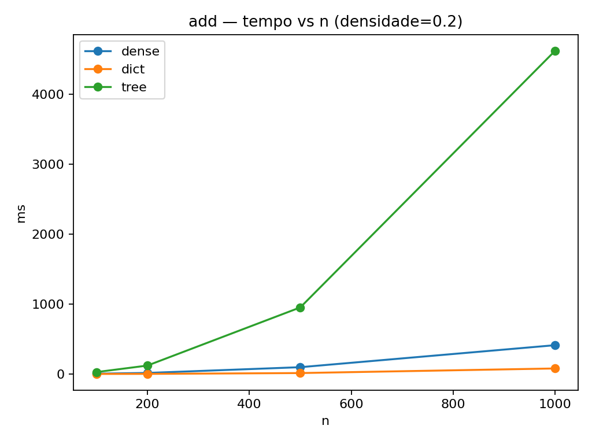
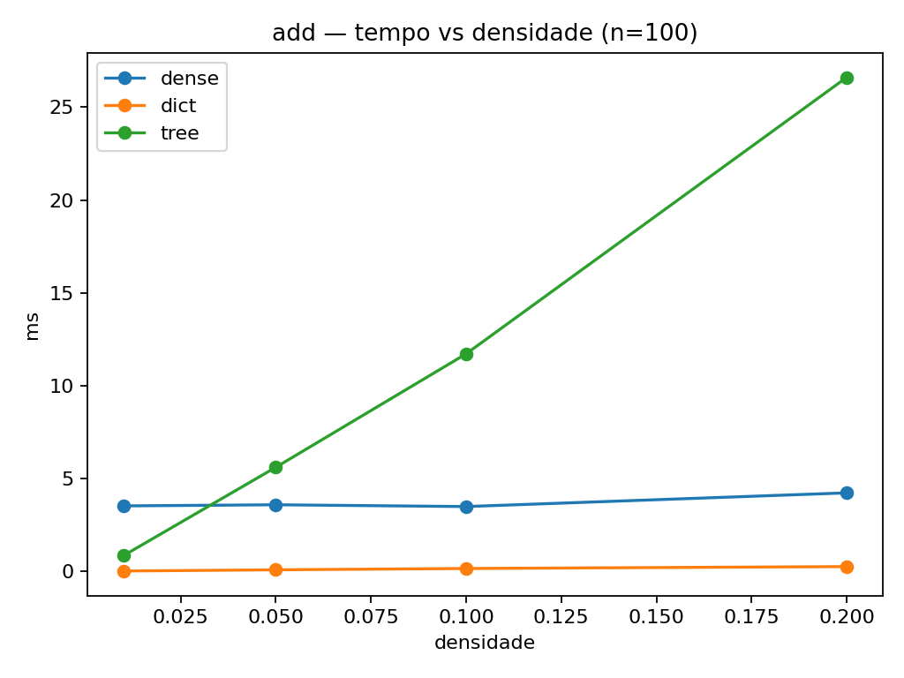
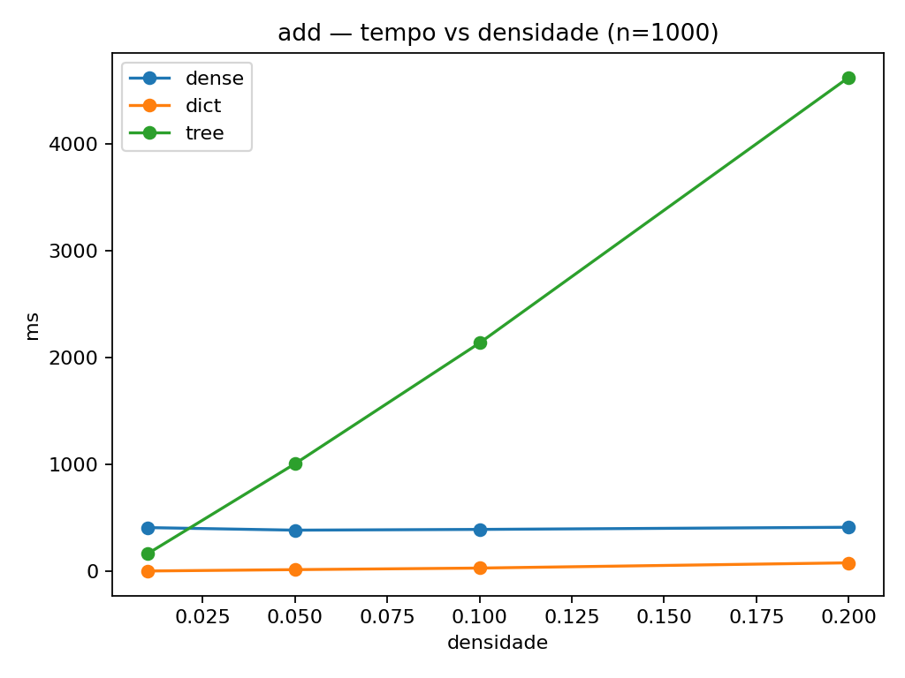
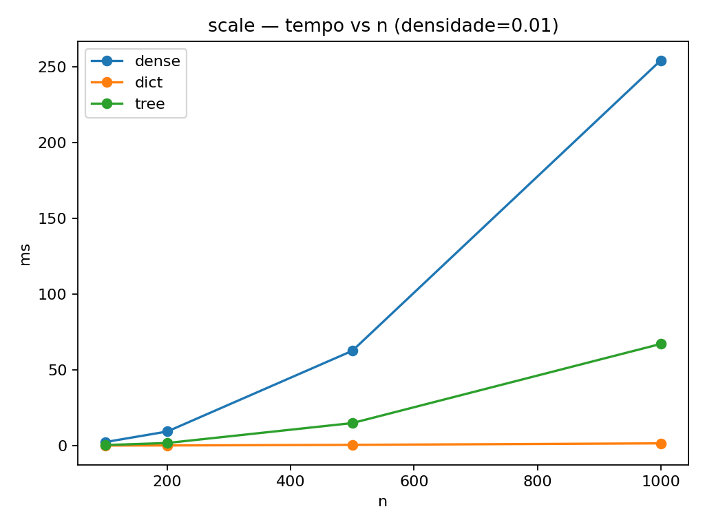
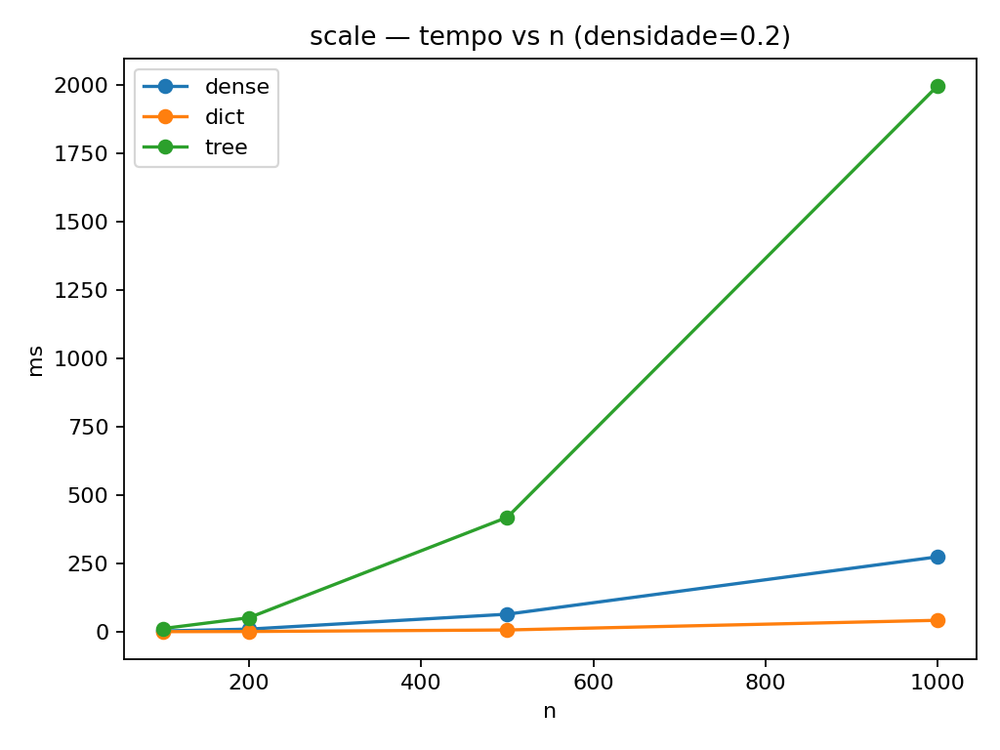

# Relatório  Matrizes Esparsas (Hash vs AVL)

**Autores:** Gabriel Pereira
**Disciplina:** MC458
**Data:** 2025-11-18

## Resumo

Implementamos duas estruturas para matrizes esparsas: (i) *dict-of-dicts* (hash, O(1) médio) e (ii) árvore AVL por chave (i,j) (O(log k) garantido), além de baseline denso. Comparamos `add`, `scale`, `matmul` e `transpose` nos tamanhos e densidades do enunciado. Razões de tempo típicas: mediana(tree/dict) ≈ **61.9×**, mediana(dense/dict) ≈ **34.8×**.

## Introdução

Dizemos que uma matriz é **esparsa** quando o número de elementos não nulos `k` satisfaz `k ≪ n·m`. Nesses cenários, estruturas esparsas evitam varrer zeros, reduzindo custo temporal e espacial.

## Estruturas de Dados

### Hash (dict-of-dicts)
- Layout: linha → {coluna → valor}; zeros removem a entrada.
- Complexidades: `get/set` O(1) médio; `transpose` O(1); `add` O(kA+kB); `scale` O(k); `matmul` ≈ O(kA·dB).

### AVL (árvore por (i,j))
- Chave `(i,j)` em ordem lexicográfica; `iter_row(i)` por faixa.
- Complexidades: `get/set` O(log k); `transpose` O(1); `add` O((kA+kB)·log k); `scale` O(k); `matmul` ≈ O(kA·dB·log kC).

## Metodologia Experimental

Tamanhos testados: 100, 200, 500, 1000.
Densidades testadas: 0.01, 0.05, 0.1, 0.2.
Operações: add, matmul, scale.
Tempo reportado: melhor de N repetições por caso.

## Resultados

**add — tempo vs n** (densidade 0.01):

**add — tempo vs n** (densidade 0.2):

**add — tempo vs densidade** (n100):

**add — tempo vs densidade** (n1000):

**scale — tempo vs n** (densidade 0.01):

**scale — tempo vs n** (densidade 0.2):

## Discussão

- Hash domina em baixa densidade (constante menor + O(1) médio).
- AVL oferece garantias e boa varredura ordenada, porém paga o fator log.
- Denso só se aproxima em densidades altas ou tamanhos pequenos.
- `transpose` é lógico (O(1)) e não depende de `nnz`.

## Conclusão

Em instâncias esparsas, **dict-of-dicts** tende a ser a melhor escolha prática; a **AVL** é indicada quando a ordenação e limites assintóticos garantidos são requisitos. Para densidades altas, representações densas tendem a vencer.
